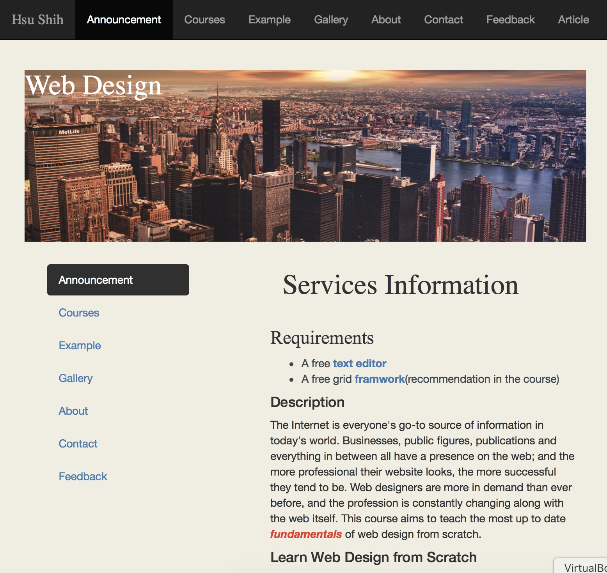
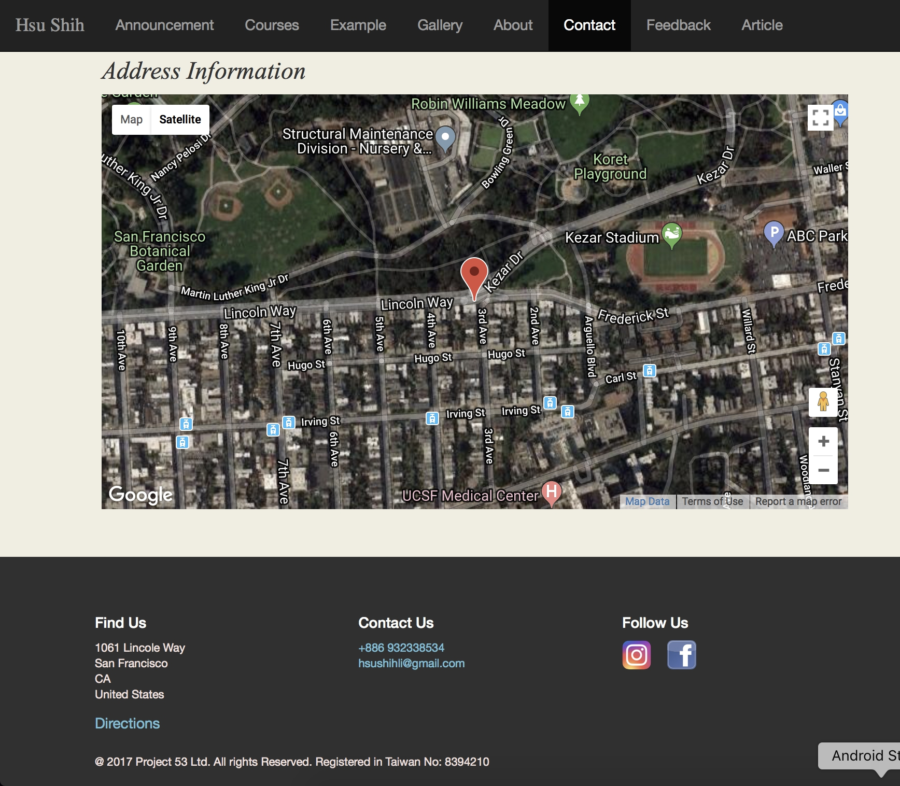

# Nodejs.web
Building a website with Nodejs

Step 1.

Download the file.
Using terminal to create a folder in desktop. 
type cd desktop -> mkdir "yourfilename".
put all the file into "yourfilename"

Step 2.

Environment setting by installing node module and package.
download nodejs on http://nodejs.org/. 
type node -v on terminal to check if the install was successful.
should see the node version like v6.10.0.

Step 3.

Go to terminal, cd "yourfilename".
once you're in the right folder, type "node app.js" or "node app".
Enter -> should shows "yourfilename" app started on port 3030.

Step 4.

Open any browser you have.
type "localhost:3030".
the whole website should pop up.

Good luck!

some picture of the website down below

